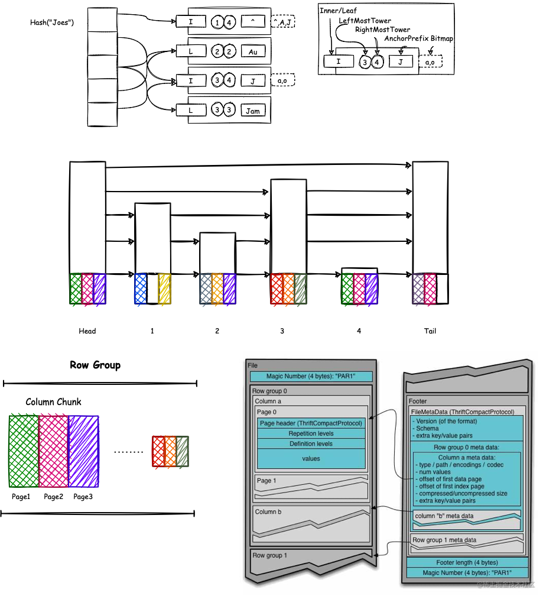

# TemplateKV

Template本意是模版，也是C++中泛型的主要语言关键字，取名模版意在指明本项目的目的是提供一个可以特化的key-value系统。

TemplateKV是一个从可观测性和云原生角度开发的可任意拆卸组装的分布式key-value数据库。TemplateKV使用Rust语言开发，对共识算法、分布式allocator对象分配器、资源分配器，分布式垃圾回收，以及分布式环境下不同的网络和存储进行统一抽象，可以在异构分布式环境下进行任意组合和自定义。不论是OLAP、OLTP，甚至是时序数据库以及后面的流式数据库，都可以通过组装得到合适的底层kv设施。

TemplateKV的设计深受各种前作的启发，比如BigTable，Spanner，Percolator，以及最近两年的各种新型数据库论文。

## 内容列表

- [背景](#背景)
- [架构](#架构)
- [简要说明](#简要说明)
- [快速构建](#快速构建)
- [维护者](#维护者)
- [如何贡献](#如何贡献)
- [使用许可](#使用许可)

## 背景

​		经典Key Value系统如RocksDB、LevelDB等都是针对单节点的存储系统，而需要再额外构建分布式公式协议来写协同一致性数据读写，多线程读写混合场景下对memtable互斥访问导致性能下降，由于level-0层的设计造城key的overlap，尤其是在当读文件时需要查找level-0层，造成了读放大，尤其是当纯随机读时，极端情况下会扫描整个level-0层，而最令人头疼的就是compaction机制并不完全受控制，可能在写入key时不造成写放大，也有可能在写入一个key后造成十几倍几十倍的写放大，并且，以rocksdb为主的c++ key-value库由于开发的比较早，其无法再使用C++20以及23提供的新features，比如coroutine和concepts。上述诸多问题在社区中都有对应的解决方案，但是引入某种解决方案的同时，带来的却是另外很多方案的妥协。

​		在以etcd、tikv等为主的分布式存储中，几乎都是使用raft/multi-raft/multi-paxos为主作为分布式共识协议来协调集群中的数据一致性。而epaxos作为leaderless的设计早在2012年就被发表，但是到目前都没有广泛应用，究其原因还是因为raft目前的实现以及优化可以应对业界环境下大部分场景，其本身并不会变成问题核心，并且还因为raft协议实现的难度要低很多，这导致了业界内大部分系统都是由raft来实现。但是这种情况在未来一段时间内可能会被改变，因为随着节点的膨胀和网络吞吐的要求，使用leaderless的分布式共识协议会成为下一个分布式存储领域的风向之一。而epaxos本身也存在很多问题，比如instance的seq去重，failover场景下保证日志序列的顺序性，接口行为需要重新设计来适应现阶段的软件栈，在冲突多的极端场景下退化为classic paxos，冲突的命令在replication层解决，影响上层并发控制等等诸多问题也需要工业具体实现上的配合来保证协议的准确性和稳定性。

​		索引结构或者叫查询数据结构以往都是以B+tree、Skiplist、Red-Black Tree为主。以MySQL和Redis和RocksDB为例，其索引以及存储结构是以B+Tree和Skiplist为主要的数据结构，而很多人熟知的其他索引查找结构：数组，链表，二叉树，散列表，二叉搜索树，平衡搜索二叉树，红黑树，我这里仅仅从数据结构的角度来浅浅分析一下这里为什么不使用，首先对于数组，链表这种线性表来说，适合存储数据，而不是查找数据，同样，对于普通二叉树来说，数据存储没有特定规律，所以也不适合，而Hash索引通常都是**随机的内存访问，对于缓存不友好**，二叉搜索树的树型取决于数据的输入顺序，极端情况下会退化成链表，平衡搜索二叉树过于严格的平衡要求，导致几乎每次插入和删除节点都会破坏树的平衡性，使得树的性能大打折扣，**红黑树的深度过大，数据检索时造成磁盘IO频繁**，并且**B-Tree和红黑树对于顺序查询并不友好**，所以使用B+tree就呼之欲出了。对于使用LSM结构的RocksDB来说，亦是如此，RocksDB需要加速写->顺序写，需要最终落盘，并且需要在有序的Block中进行高效的查询，所以这里使用内存更友好的Skiplist更好，但是还有`两个终极问题`：

`Mysql的索引为什么使用B+树而不使用跳表?`

>B+树是多叉树结构，每个结点都是一个16k的数据页，能存放较多索引信息，所以扇出很高。三层左右就可以存储2kw左右的数据。也就是说查询一次数据，如果这些数据页都在磁盘里，那么最多需要查询三次磁盘IO。跳表是链表结构，一条数据一个结点，如果最底层要存放2kw数据，且每次查询都要能达到二分查找的效果，2kw大概在2的24次方左右，所以，跳表大概高度在24层左右。最坏情况下，这24层数据会分散在不同的数据页里，也即是查一次数据会经历24次磁盘IO。
>
>因此存放同样量级的数据，B+树的高度比跳表的要少，如果放在mysql数据库上来说，就是磁盘IO次数更少，因此B+树查询更快。而针对写操作，B+树需要拆分合并索引数据页，跳表则独立插入，并根据随机函数确定层数，没有旋转和维持平衡的开销，因此跳表的写入性能会比B+树要好。

`RocksDB/Redis为什么使用跳表而不使用B+树或二叉树呢?`

>redis 是纯纯的内存数据库，以及rocksdb首先写入的也是在内存中的memtable，进行读写数据都是操作内存，跟磁盘无关，因此也不存在磁盘IO了，所以层高就不再是跳表的劣势了。并且前面也提到B+树是有一系列合并拆分操作的，换成红黑树或者其他AVL树的话也是各种旋转，目的也是为了保持树的平衡。而跳表插入数据时，只需要随机一下，就知道自己要不要往上加索引，根本不用考虑前后结点，也就少了旋转平衡的开销。因此，这里选了跳表，而不是B+树。
>
>> rocksDB内部使用了跳表，对比使用B+树的innodb，虽然写性能更好，但读性能属实差了些。在读多写少的场景下，B+树依旧风采依旧。

​		但是随着并发技术的发展，像MassTree、ART、BwTree、PSL等演进出来的并发数据结构渐渐被熟知。可是亦是由于其过高的实现难度以及现有系统中使用优化的传统数据结构都可以满足需求，导致这种优雅复杂的高级数据结构也就是停留在学术论文上，在实际系统中使用的寥寥无几。并且在近几年，并发编程逐渐流行，lock-free&&wait-free的概念也逐渐被很多系统采用，但是很多系统也都并未使用这种数据结构来作为底层数据来使用，一方面说明这种数据结构在上层应用少，另外一方面也说明目前工业对与使用lock-free与否，还存在不小的争议。

​		并且，随着数据处理的发展，对时间序列数据的实时处理也逐渐和OLAP、OLTP进行很多交叉，界限逐渐变得模糊。而近两年流式数据库的兴起，预示着针对流式数据的处理逐渐下放到数据库，也给数据库的开发、部署、运维提出了更高的要求。而在这个背景下，本项目设计一种适应流式数据的KV存储引擎，以leaderless的分布式共识算法和重新设计的内存数据结构为核心，以可插拔、可任意组合为目标设计积木风格式的组合底层架构，并且考虑到RDMA、DPDK、SPDK以及非易失性存储和epbf的背景，将Storage和Network层拆分，更高效的利用bypass内核的能力。

​		最后本项目本着寓教于学的目的，除了经典算法，还会纳入很多近几年顶会中的设计，一是为了尝试推进数据库领域的发展，二是能尝试填补学术和工业设计之间的鸿沟，为很多像我一样热爱计算机底层开发的伙伴展示更多的可能性。

## 架构

主要的架构如下所示：


一言以蔽之，将流式数据和命令封装成streaming executor经过epaxos状态机流转，最后应用到(可能)不同的(远端)存储介质上。流式KV存储引擎还应该有如下的能力：

- 每个streaning executor都可以读到自己节点以及其他节点的数据；
- 数据节点的metadata、log等元信息共享；
- 快照读对于自己的节点的数据是等于当前读，读另外的节点需要等待epoch；
- 对于流式数据支持乱序提交，但是execute以及最后apply的顺序根据具体的命令和依赖关系判断。

其中每个节点都是epaxos consensus group的普通一员，其有多种身份信息，MetaNode、ComputeNode、以及CompactionNode。其中：

- MetaNode：每个节点承担metadata的同步和共享工作，无论是查询还是写入，无论使用group中任何一个节点，都可以找到数据在自己还是别人，本地还是远端存储；
- ComputeNode：天生计算靠近底层，每个节点也是计算单元，同时也会将计算推到group中其他节点，“steal”其他节点的算力；
- CompactionNode：Compaction指令来自自己或者是其他的节点的Meta消息(超过某个阈值或者单独的compact指令)，完成后向quorum/epoch内的节点报告完成消息。

> 为了在不影响压缩的情况下支持MVCC读，后续将在epoch中跟踪水位线，要么是最新的，要么是低于水位线的，将保留keyvalue。

## 简要说明

### 积木策略


根据一个KV写入的声明周期，和不同的使用场景，本项目提供了统一的接口但是不同的底层实现以供参考和选择或者自定义开发。从内存数据结构、allocator、内存回收策略、预写日志以及合并策略上预先分别提供了经典的和比较新的实现和玩法。而其中绿色是本项目使用时下比较新的论文和作者的一些创意进行的新的尝试，仅供参考，其中：

- Template：针对KV存储，其以ShardMap、Trie、以及Skiplist为基础，开发的lock-free数据结构；
- Templatealloc：针对存储系统、索引数据开发的提高内存利用的内存分配器，后期考虑加入分配调度策略；
- Crystalline：融合HP+EBR的Wait-free内存回收策略；
- Waltz：分布式WAL；
- SILK：结合IO调度的新Compaction策略。

### 内存数据结构



本项目的核心之一如上图所示，其为本次项目的核心设计之一，用户写入kv，使用Map结构查找具体属于哪一个Trie节点：

1. 叶子结点：直接掉入Skiplist中的Tower中进行判断，获得对应的Column Chunk，然后再针对Column Chunk进行二分查找；
2. 非叶子结点：使用Skiplist中部分的Tower对Key进行局部二分，查找到对应合适的Tower进行插入操作，其中：
   1. 插入page的过程等同于native skiplist的插入，只不过对key进行压缩，多个前缀相同的key放入同一个page中，二次前缀相同的放入同一个Chunk中；
   2. Chunk膨胀后会进行分裂，直接将多余的page页面合并入其他的Tower节点即可。
3. 写入最后会变为Parquet结构，多个Page组合为一个Column Chunk(Tower)，多个Chunk划分为一个Row Group(Partition);
4. 针对性优化：
   1. 使用SIMD加速，对列存结构友好；
   2. 对不同的Partition进行绑核，提高cache line命中；
   3. ShardMap+Trie使用加锁，底层Skiplist使用lock-free结构；


### 内存分配策略

TODO


### 内存回收策略

TODO


### WAL

TODO


### Compaction

TODO

## 快速构建

**Compile from Source with Linux and macOS)**

```bash
# Install Rust toolchain
curl --proto '=https' --tlsv1.2 -sSf https://sh.rustup.rs | sh
# Clone the repo
git clone https://github.com/devillove084/TemplateKV.git && cd TemplateKV
# Compile
cargo build --release
# Test
cargo install nextest # (Optional)Use next test framework
cargo nextest test
```

## 维护者

[@devillove084](https://github.com/devillove084)

## 如何贡献

非常欢迎你的加入！[提一个 Issue](https://github.com/devillove084/TemplateKV/issues/new) 或者提交一个 Pull Request，参照[CONTRIBUTING.md](https://github.com/devillove084/TemplateKV/main/docs/CONTRIBUTING.md)。


TemplateKV遵循 [Contributor Covenant](http://contributor-covenant.org/version/1/3/0/) 行为规范。


## 使用许可

TemplateKV 使用Apache 2.0 license。详细内容参考[LICENSE](./LICENSE)。

